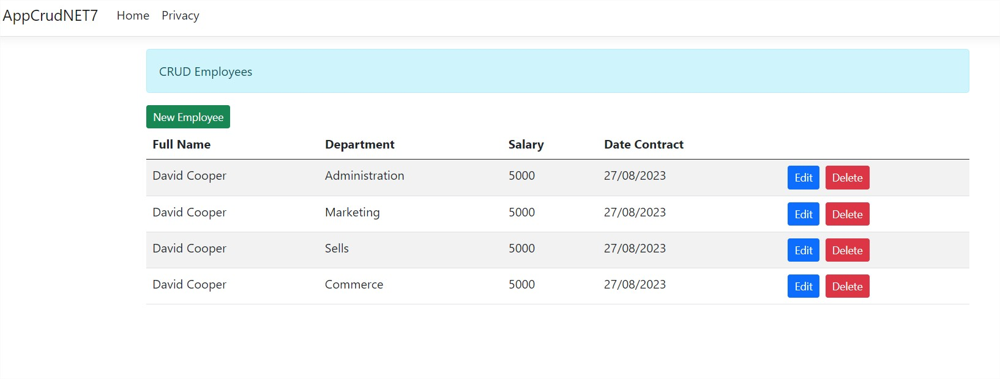
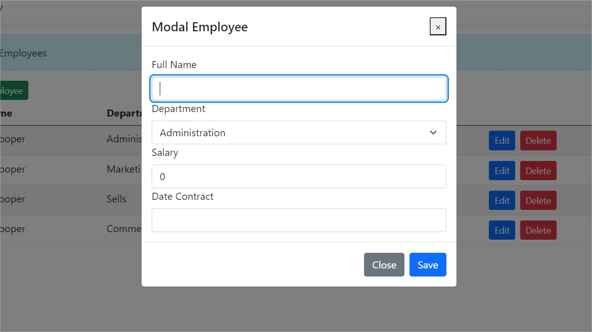
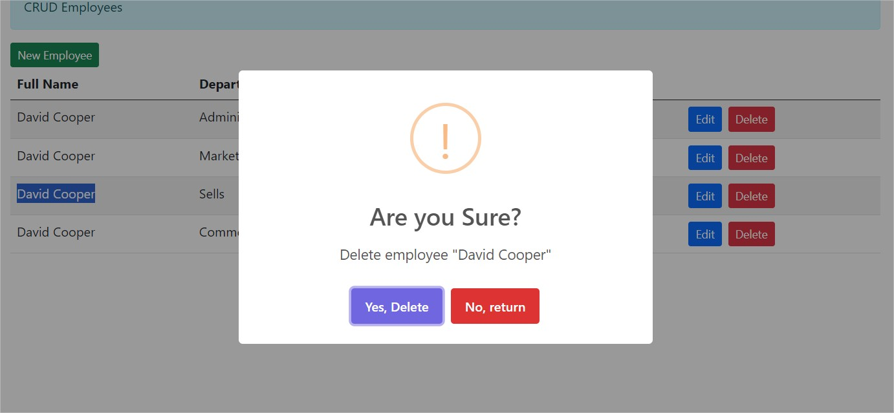

# Practica CRUD de ASP.NET 7 MVC para Gestión de Empleados con SQL Server usando ADO.NET

Este proyecto es un ejemplo de una aplicación CRUD (Crear, Leer, Actualizar, Eliminar) desarrollada en ASP.NET 7 MVC. La aplicación permite gestionar empleados, incluyendo la capacidad de agregar, editar y borrar empleados.

## Características

- Vista de lista de empleados con información básica.
- Funcionalidad de agregar nuevos empleados con detalles completos.
- Capacidad de editar información de empleados existentes.
- Opción para borrar empleados de la base de datos.
- Interfaz de usuario intuitiva para una experiencia amigable.

## Capturas de Pantalla

## Instrucciones de Uso

1. Clona este repositorio en tu máquina local.
2. Abre el proyecto en tu entorno de desarrollo (Visual Studio, Visual Studio Code, etc.).
3. Asegúrate de tener instalado .NET 7 SDK.
4. Configura la cadena de conexión a la base de datos en `appsettings.json`.
5. Ejecuta la aplicación y navega a la URL proporcionada en tu navegador.

## Uso de la Aplicación

- La página principal muestra una lista de empleados con sus nombres y detalles básicos.
- Para agregar un nuevo empleado, haz clic en el botón "Agregar Empleado" y completa la información requerida.
- Para editar la información de un empleado, haz clic en el enlace "Editar" junto al empleado correspondiente y realiza los cambios necesarios.
- Para borrar un empleado, haz clic en el enlace "Borrar" junto al empleado y confirma la eliminación.

## Contribuciones

Las contribuciones son bienvenidas. Si encuentras algún problema o tienes sugerencias de mejoras, por favor abre un issue en este repositorio. Si deseas contribuir con código, realiza un pull request y estaremos encantados de revisarlo.

## Licencia

Este proyecto está bajo la Licencia MIT. Para más detalles, consulta el archivo [LICENSE](LICENSE).

---

Desarrollado por [Tu Nombre](https://github.com/tuusuario)
